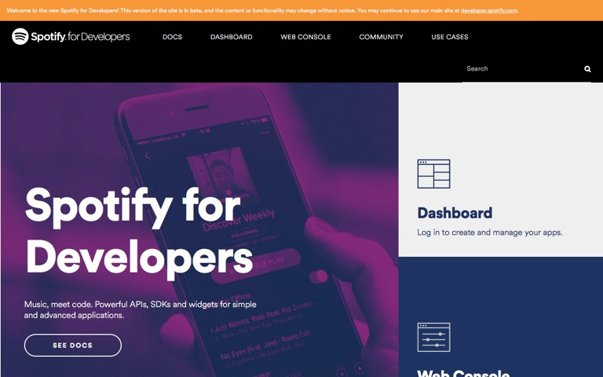
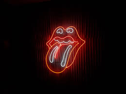
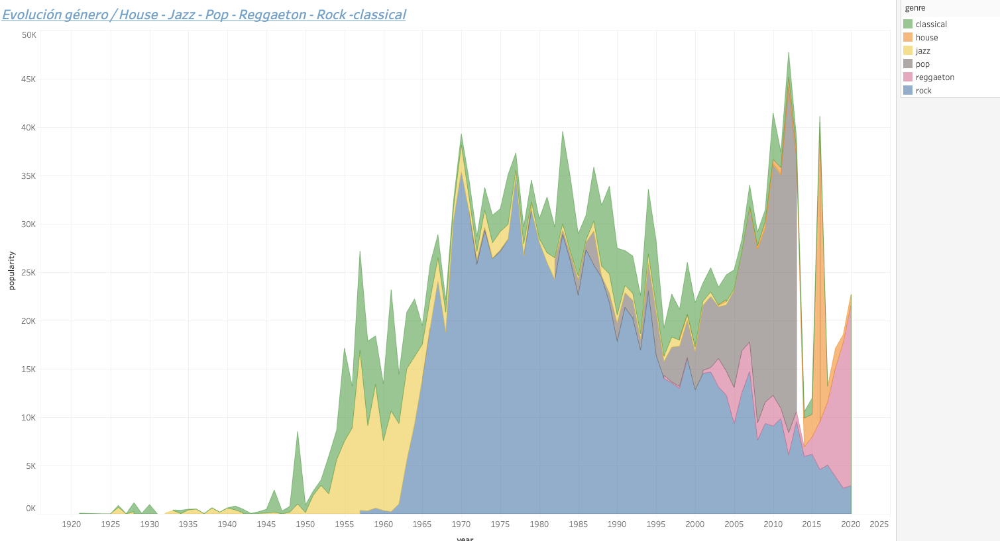
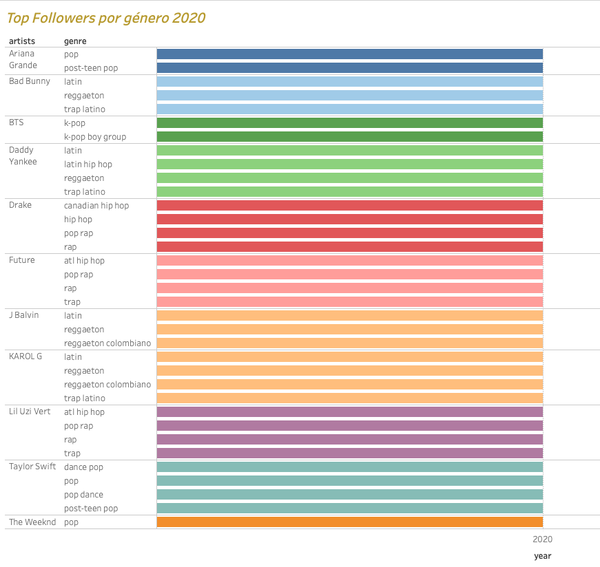
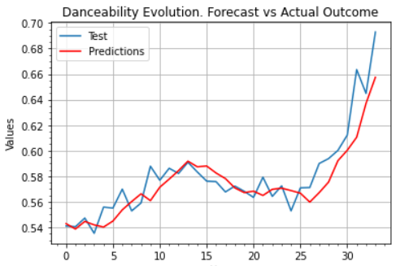

# Historia de la musica contenporánea a través de Spotify

Bienvenido al proyecto de análisis de la historia de la música contemporánea  de la mano de Spotify.

## Secciones:
-[Objetivo del proyecto](#Objetivo-del-proyecto)

-[Analisis y limpieza de la base de datos](#Analis-y-limpiezada-de-la-base-de-datos)

-[Uso de la API de Spotify](#Uso-de-la-API-de-Spotify)

-[Visualizacion de datos con Tableau](#Visualizacion-de-datos-con-Tableau)

-[Prediccion de tendencias futuras mediante Machine Learning](#MPrediccion-de-tendecias-futuras-mediante-Machine-Learning)

-[Retos afrontados durante el proyecto](#Retos-afrontados-durante-el-proycto)

-[Conclusiones](#Conclusiones)

## Objetivo del proyecto:

Realizar un estudio en profundidad de la historia de la música contemporánea mediante una base de datos de más de 170k canciones, desde los años 20 hasta la actualidad.

Estudiaremos cómo ha ido evolucionando la música contemporánea hasta nuestros días en función de diferentes parámetros.

Asimismo, realizaremos predicciones para predecir tendencias futuras.

## Análisis y limpieza de la base de datos:

Empezamos con un análisis preliminar y con la limpieza de nuestro dataset. Hemos utilizado los datos de la siguiente fuente: 

https://www.kaggle.com/yamaerenay/spotify-dataset-19212020-160k-tracks

Estos serán los diferentes parámetros a estudiar:

1) Primary:
- id (Id of track generated by Spotify)
2) Numérical:
- acousticness (Rango de 0 a 1)
- danceability (Rango de 0 a 1)
- energy (Rango de 0 a 1)
- duration_ms (Integer typically ranging from 200k to 300k)
- instrumentalness (Rango de 0 a 1)
- valence (Rano de 0 a 1)
- popularity (Rango de 0 a 100)
- tempo (Float,  rango entre 50 y 150)
- liveness (Rango de 0 a 1)
- loudness (Float, entre -60 y 0)
- speechiness (Rango entre 0 y 1)
- year (Rango entre 1921 y 2020)
3) Dummy:
- mode (0 = Canción en tonalidad menor, 1 = canción en tonalidad mayor)
- explicit (0 = No hay contenido explicito, 1 = Existe contenido explícito
4) Categorical:
- key (All keys on octave encoded as values ranging from 0 to 11, starting on C as 0, C# as 1 and so on…)
- artists (Lista de artistas)
- release_date (Fecha de lanzamiento, generalmente en el siguiente formato, yyyy-mm-dd format, sin embargo, la precisión de la fecha puede variar
- name (Nombre de la canción)

## Uso de la API de Spotify

Usaremos la librería de Python, spotipy, para enriquecer nuestro dataset.

Para ello debemos darnos de alta en la web de spotify (Spotify for Developers) para obtener un Client_ID y un Client_Secret que utilizaremos con un entorno .env

Hemos añadido dos nuevas columnas que son el género y los fowollers por artista, para tener un estudio más completo y así, enriquecer nuestros datos.

## Visualización de datos (Tableau)

i) Análisis de la evolución de los siguientes parámetros a través del tiempo:

- acousticness
- danceability
- energy
- duration_ms
- instrumentalness 
- valence 
- popularity
- tempo
- liveness
- loudness
- speechiness

iii) Top 10 artistas de la historia por popularidad

iv) Evolución del género musical a través de los años

v) Top 10 artistas en cuanto a numero de followers en la actualidad

## Predicción de tendencias futuras: ARIMA (Autoregressive Integrated Moving Average Model)

A través de Time Series Regression, realizaremos una predicción futura en base al comportamiento que haya tenido la variable en el pasado.

A través de Datetime, estudiaremos el histórico y mediante la librería de statsmodels, seasonal_decompose, haremos un análisis de tendencia, estacionalidad y residuos

A través del modelo ARIMA, haremos una predicción futura en base al histórico de las siguientes variables:

- acousticness
- danceability
- loudness
- energy

## Predicción de tendencias futuras: ARIMA (Autoregressive Integrated Moving Average Model)

Posteriormente, intentaremos predecir el numero de followers futuros que hemos obtenido a traves de la API, entrenando nuestro modelo con las variables predictoras. Los modelos que utilizaremos serán los siguientes:

a) Regresión Lineal
b) Random Forest Regression

Lo primero será eliminar las variables categóricas que no tienen correlación con los followers.

A continuación, estandarizaremos los datos, ya que tenemos rangos muy diferentes entre los predictores. Para ello utilizaremos la libreria StandardScaler.

## Retos afrontados durante el proyecto

En cuanto a la limpieza y manejo de datos, Uno de los principales retos del proyecto ha sido el tratamiento de una extensa base de datos.

Por otro lado, otro de los retos ha sido el enriquecer nuestra base de datos. Lo hemos reaizado mediante la API de spotipy, donde teníamos que rellenar el género y los followers de 170.000 canciones, aunque no hemos encontrado límite en hacer request a la API.

En la parte de Machine Learning, el primer paso ha sido estandarizar los datos, donde hemos usado la libreria de Python StandardScaler, ya que teníamos rangos muy diversos en nuestros predictores.

## Conclusiones

Hemos podido predecir cómo serán las tendencias de los parámetros acousticness, danceability, loudness y energy en función del histórico de datos.

En cuanto a la predicción de los followers futuros por artistas, nos hemos encontrado con unos RMSE muy altos, y muy poco accuracy, tanto en el modelo de regresión lineal como en el modelo de Random Forest Regression, por lo que no son concluyentes debido al gran numero de outliers.

